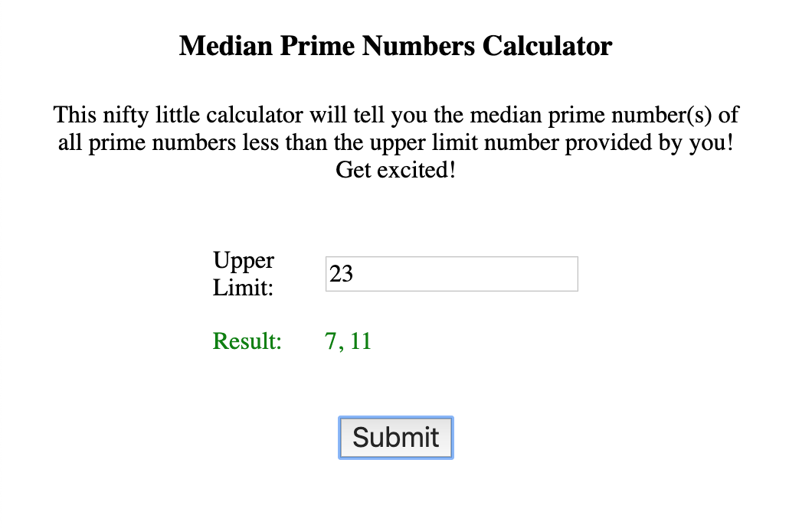

## Sample NPM Fargate App
**Note this not production grade and simply meant as a demo**

This repository contains backend and front end components for calculating median prime numbers given an upper limit value

### Containerized (ECS Fargate)
Todo

### Containerized (Docker-Compose)
Todo

### Containerized (Manual)

#### Backend
1. docker build . -t prime-be
2. docker run -p 3001:3001 prime-be

#### Frontend
We are passing in environment variables which will override the values in the .env

1. docker build . -t prime-fe
2. docker run -p 8001:8001 --env REACT_APP_BACKEND_URI=http://localhost --env REACT_APP_BACKEND_PORT=3001 prime-fe

### Manual

#### Backend

##### Using the API
1. `cd prime-calculator-nodejs`
2. `npm start`
3. `GET http://localhost:3001/median_prime_numbers?upper_limit=<integer>`

##### Testing
`npm test`

#### Frontend

##### Running the app
1. `cd median-prime-numbers-react-app`
2. `npm start`
3. `http://localhost:3000`

##### Testing
`npm test`